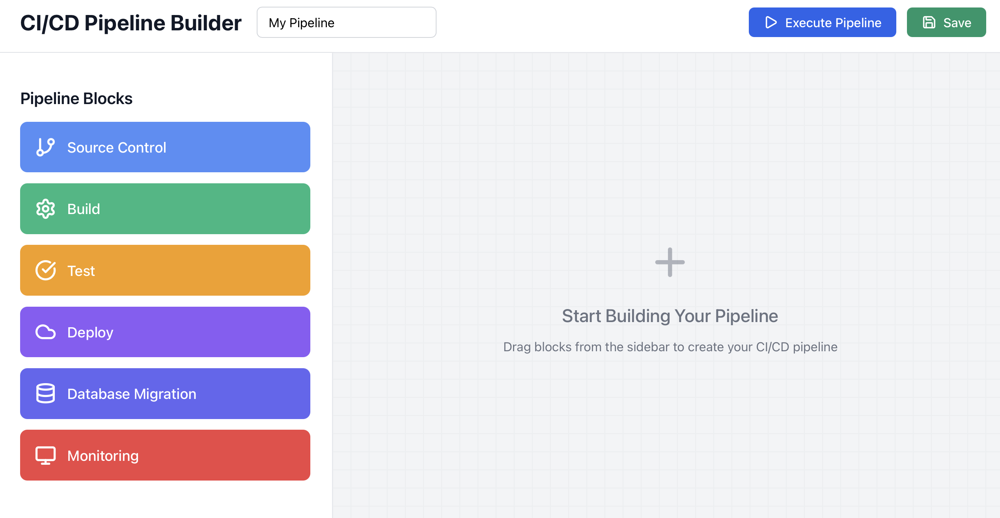

# CI/CD Pipeline Builder

A modern, interactive visual pipeline builder for creating and managing CI/CD pipelines. Built with React and featuring a drag-and-drop interface, real-time execution simulation, and CloudFormation template generation.
<p align="center">
 </p>

## 🚀 Features

### Visual Pipeline Design
- **Drag & Drop Interface**: Intuitive block-based pipeline creation
- **Real-time Visual Feedback**: Interactive canvas with grid alignment
- **Block Connections**: Visual representation of pipeline flow
- **Multiple Block Types**: Source control, build, test, deploy, database, and monitoring blocks

### Pipeline Management
- **Configuration Panel**: Dynamic configuration for each pipeline block
- **Pipeline Execution**: Simulated execution with real-time logging
- **Save/Export**: Export pipelines as JSON with embedded CloudFormation templates
- **Pipeline Naming**: Customizable pipeline names and metadata

### Monitoring & Logging
- **Execution Logs**: Real-time pipeline execution monitoring
- **Status Indicators**: Visual status updates (running, success, error)
- **Timestamped Logs**: Detailed execution timeline
- **Progress Tracking**: Step-by-step execution visualization

## 📋 Prerequisites

- Node.js 16.0 or higher
- npm or yarn package manager
- Modern web browser (Chrome, Firefox, Safari, Edge)

## 🛠️ Installation

### Clone the Repository
```bash
git clone https://github.com/your-username/cicd-pipeline-builder.git
cd cicd-pipeline-builder
```

### Install Dependencies
```bash
npm install
# or
yarn install
```

### Required Dependencies
```json
{
  "react": "^18.0.0",
  "react-dom": "^18.0.0",
  "lucide-react": "^0.263.1"
}
```

### Start Development Server
```bash
npm start
# or
yarn start
```

The application will be available at `http://localhost:3000`

## 🎯 Usage

### Creating a Pipeline

1. **Name Your Pipeline**
   - Click on the pipeline name in the header to edit
   - Enter a descriptive name for your CI/CD pipeline

2. **Add Pipeline Blocks**
   - Drag blocks from the left sidebar onto the main canvas
   - Available block types:
     - **Source Control**: Git repository integration
     - **Build**: Compilation and build processes
     - **Test**: Automated testing and validation
     - **Deploy**: Application deployment
     - **Database Migration**: Database schema updates
     - **Monitoring**: Observability and alerting

3. **Configure Blocks**
   - Click on any block to select it
   - Use the configuration panel to customize block settings
   - Each block type has specific configuration options

4. **Execute Pipeline**
   - Click the "Execute Pipeline" button to simulate execution
   - Monitor progress in the real-time logs panel
   - View execution status and timestamps

5. **Save Pipeline**
   - Click "Save" to export your pipeline configuration
   - Downloads a JSON file with pipeline definition and CloudFormation template

### Block Configuration Options

#### Source Control Block
```javascript
{
  repo: 'repository-url',
  branch: 'main',
  provider: 'github'
}
```

#### Build Block
```javascript
{
  buildspec: 'buildspec.yml',
  runtime: 'node18',
  commands: ['npm install', 'npm run build']
}
```

#### Test Block
```javascript
{
  testCommand: 'npm test',
  coverage: true,
  reports: true
}
```

#### Deploy Block
```javascript
{
  environment: 'staging',
  service: 'lambda',
  region: 'us-east-1'
}
```

#### Database Migration Block
```javascript
{
  type: 'rds',
  scripts: [],
  backup: true
}
```

#### Monitoring Block
```javascript
{
  alerts: true,
  dashboard: true,
  logs: true
}
```

## 🏗️ Architecture

### Component Structure
```
src/
├── components/
│   └── CICDPipelineBuilder.jsx    # Main component
├── styles/
│   └── inline-styles.js           # Styling definitions
└── utils/
    └── pipeline-helpers.js        # Utility functions
```

### Key Components

#### Main Application (`CICDPipelineBuilder`)
- Central state management for pipeline data
- Drag and drop functionality
- Canvas rendering and interaction handling
- Pipeline execution simulation

#### Block Library Sidebar
- Available pipeline block types
- Drag source for new blocks
- Configuration panel for selected blocks

#### Canvas Area
- Drop target for pipeline blocks
- Visual representation of pipeline flow
- Grid-based alignment system
- Block selection and interaction

#### Execution Logs Panel
- Real-time execution monitoring
- Status indicators and timestamps
- Scrollable log history

### State Management

The application uses React's built-in state management with hooks:

```javascript
const [selectedBlock, setSelectedBlock] = useState(null);
const [pipelineBlocks, setPipelineBlocks] = useState([]);
const [connections, setConnections] = useState([]);
const [pipelineName, setPipelineName] = useState('My Pipeline');
const [isExecuting, setIsExecuting] = useState(false);
const [executionLogs, setExecutionLogs] = useState([]);
```

## 🎨 Styling

The application uses inline styles for complete CSS independence. No external CSS frameworks required.

### Style Organization
- Centralized style object with semantic naming
- Component-specific styling
- Hover states and transitions
- Responsive design patterns

### Color Scheme
- **Primary Blue**: `#2563EB` (Execute button, connections)
- **Success Green**: `#10B981` (Build blocks, success states)
- **Warning Yellow**: `#F59E0B` (Test blocks, running states)
- **Error Red**: `#EF4444` (Error states, delete actions)
- **Purple**: `#8B5CF6` (Deploy blocks)
- **Indigo**: `#6366F1` (Database blocks)

## 🔧 Customization

### Adding New Block Types

1. **Define Block Type**
```javascript
const newBlockType = {
  icon: YourIcon,
  name: 'Your Block Name',
  color: '#HEX_COLOR',
  config: { /* default configuration */ }
};
```

2. **Add to blockTypes Object**
```javascript
const blockTypes = {
  // existing types...
  yourBlockType: newBlockType
};
```

3. **Handle Configuration**
Ensure the configuration panel can handle your block's specific configuration fields.

### Styling Modifications

All styles are contained in the `styles` object. Modify colors, spacing, and layout by updating the corresponding style definitions.

### Execution Logic

The pipeline execution is simulated. To integrate with real CI/CD systems:

1. Replace the `executePipeline` function
2. Integrate with your CI/CD API
3. Update the logging mechanism for real-time updates

## 📁 Export Format

### Pipeline JSON Structure
```json
{
  "name": "Pipeline Name",
  "blocks": [
    {
      "id": "source-1234567890",
      "type": "source",
      "x": 200,
      "y": 150,
      "config": {
        "repo": "https://github.com/user/repo",
        "branch": "main",
        "provider": "github"
      }
    }
  ],
  "connections": [
    {
      "from": "source-1234567890",
      "to": "build-1234567891"
    }
  ],
  "cloudFormation": "/* CloudFormation template */"
}
```

### CloudFormation Integration

The application automatically generates basic CloudFormation templates for AWS CodePipeline integration. The generated template includes:

- CodePipeline resource definition
- Stage configuration based on pipeline blocks
- Action mappings for different block types

## 🚀 Deployment

### Build for Production
```bash
npm run build
# or
yarn build
```

### Deploy to Static Hosting
The application is a static React app and can be deployed to:
- Netlify
- Vercel
- AWS S3 + CloudFront
- GitHub Pages
- Any static hosting provider

### Environment Variables
No environment variables required for basic functionality.


## 📈 Performance Considerations

### Optimization Features
- React component memoization for block rendering
- Efficient state updates using functional updates
- SVG-based connections for smooth rendering
- Optimized drag and drop with minimal re-renders

### Browser Compatibility
- Modern browsers (ES6+ support required)
- Chrome 70+, Firefox 65+, Safari 12+, Edge 79+

## 🛡️ Security

### Client-Side Only
- No server-side components
- No data persistence beyond browser session
- Export files are generated client-side only

### Data Handling
- All pipeline data stored in browser memory
- No external API calls in base implementation
- User data never leaves the client

## 🤝 Contributing

### Development Setup
1. Fork the repository
2. Create a feature branch
3. Install dependencies
4. Make your changes
5. Add tests for new functionality
6. Submit a pull request

### Code Style
- ESLint configuration provided
- Prettier for code formatting
- Consistent naming conventions
- Comprehensive comments

### Pull Request Process
1. Ensure all tests pass
2. Update documentation if needed
3. Add screenshots for UI changes
4. Describe changes in PR description


## 🐛 Troubleshooting

### Common Issues

#### Blocks Not Dragging
- Ensure browser supports HTML5 drag and drop
- Check for JavaScript errors in console
- Verify event handlers are properly attached

#### Execution Not Starting
- Check that at least one block exists in pipeline
- Verify no JavaScript errors in console
- Ensure execution button is not disabled

#### Export Not Working
- Check browser's download settings
- Verify blob URL support in browser
- Ensure no popup blockers interfering

### Browser Support
- **Supported**: Chrome, Firefox, Safari, Edge (modern versions)
- **Not Supported**: Internet Explorer, very old browser versions

## 📞 Support

- **GitHub Issues**: Report bugs and feature requests
- **Documentation**: Check this README for detailed information
- **Community**: Discussions tab for questions and ideas

## 🔮 Roadmap

### Planned Features
- [ ] Real CI/CD system integrations (Jenkins, GitHub Actions, GitLab CI)
- [ ] Advanced block connections with conditional logic
- [ ] Pipeline templates and presets
- [ ] Collaboration features
- [ ] Pipeline versioning and history
- [ ] Advanced monitoring and analytics
- [ ] Custom block creation interface
- [ ] Multi-environment deployment support

### Version History
- **v1.0.0**: Initial release with basic pipeline building
- **v1.1.0**: Added CloudFormation export
- **v1.2.0**: Improved execution simulation
- **v2.0.0**: Removed Tailwind CSS dependency (current)

---

Built with ❤️ using React and modern web technologies.
